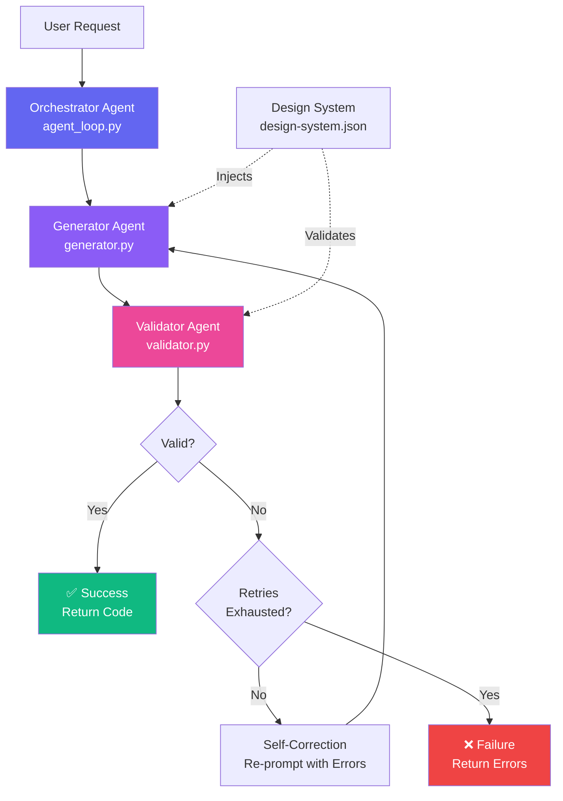
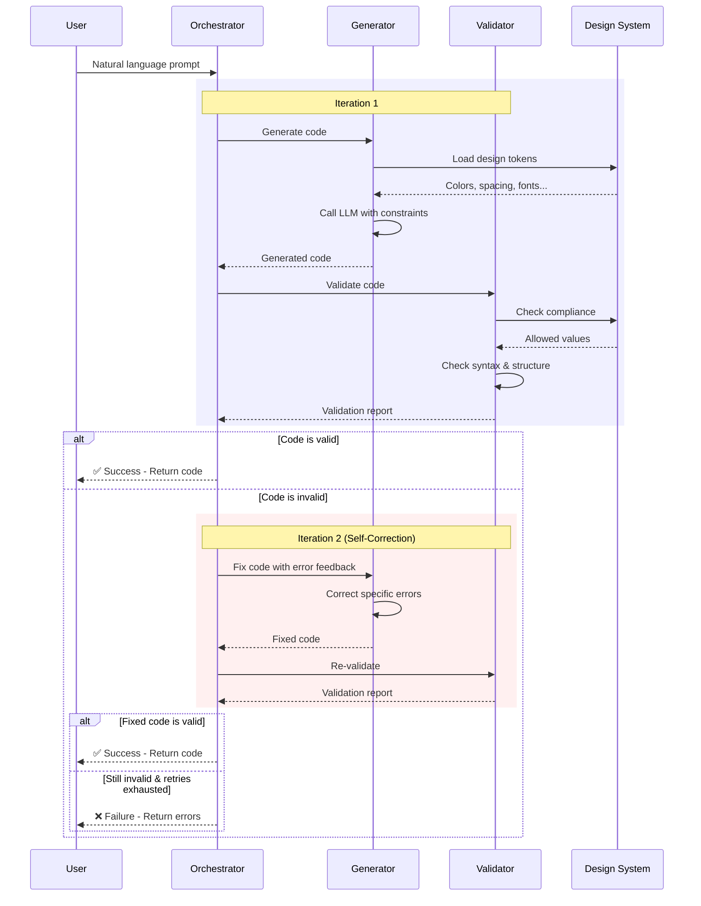
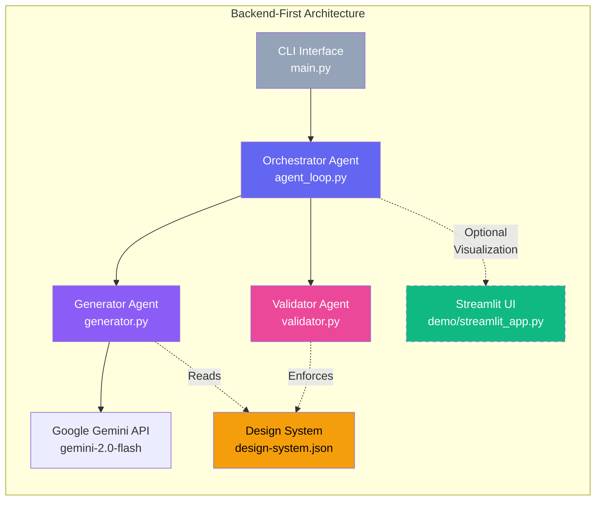
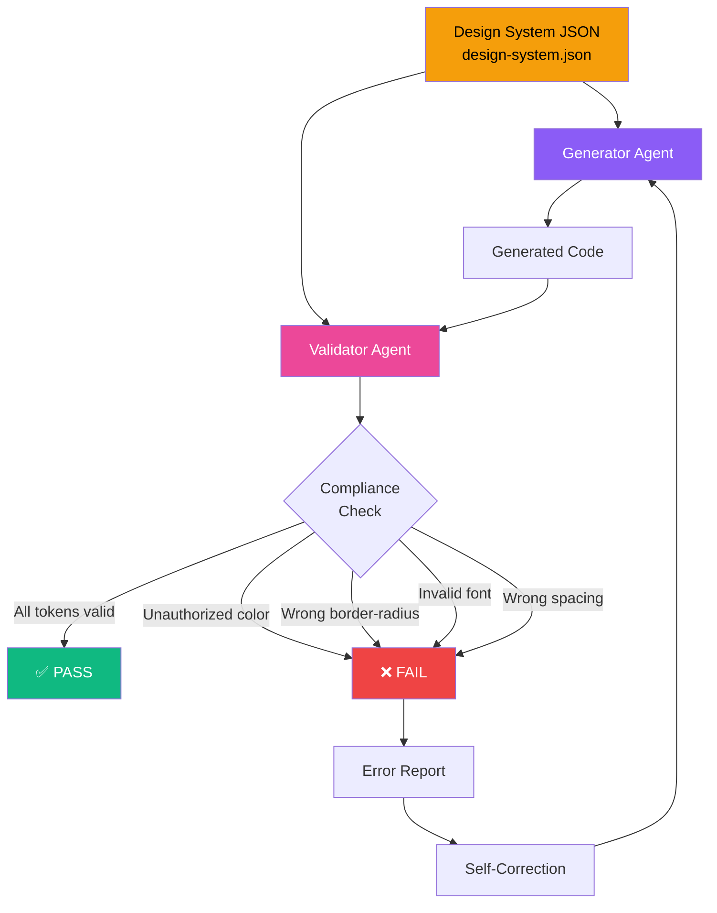

# Governed Angular UI Generator

A production-grade agentic code-generation system that converts natural language UI descriptions into valid, styled Angular components while strictly enforcing a predefined design system.

**TL;DR**
- Converts natural language UI intent into validated Angular components
- Enforces a strict design system via programmatic validation
- Uses a multi-agent, self-correcting architecture
- Treats failures as governed rejections, not bugs
- Designed as a compiler-like system, not a chatbot

## 🎯 What This System Does

This is NOT a chatbot. This is NOT simple prompt engineering.

This is an **autonomous multi-agent system** that:
- Generates governed Angular component code from natural language
- Validates outputs against strict design system rules
- Self-corrects through an iterative agent loop when validation fails
- Enforces design token compliance to prevent style drift
- Produces production-ready code, not explanations

Think of it as a miniature version of Lovable, Bolt.new, or v0.dev - but focused on Angular components with strict governance. Unlike those tools, this system prioritizes deterministic validation over free-form generation.

## 🧠 Mental Model

Think of this system as a **UI compiler**:

- **Input** → declarative UI intent
- **Output** → validated Angular component
- **If output violates rules** → compilation error + retry
- **Styling freedom is intentionally restricted**

If a prompt fails, that means the system successfully prevented unsafe or non-compliant output. Failures are features, not bugs.

## 🏗️ Agentic Architecture

### System Overview



### Self-Correction Loop




### Multi-Agent Collaboration



### Why This Is NOT Simple Prompt Engineering

1. **Multi-Agent System**: Three distinct agents (Generator, Validator, Orchestrator) with separate responsibilities
2. **Self-Correction Loop**: Automatic retry mechanism with error feedback - the system improves its own output
3. **Stateful Iteration**: Each retry uses context from previous failures
4. **Validation-Driven**: Code is programmatically validated, not just "hoped to be correct"
5. **Sandboxed Generation**: Design system acts as a hard constraint, not a suggestion
6. **Production Mindset**: Built for reliability, not demos

## 📁 Project Structure

```
governed-angular-ui-generator/
│
├── design-system.json      # Immutable design tokens (source of truth)
├── generator.py            # Code Generation Agent
├── validator.py            # Validation/Linter Agent
├── agent_loop.py           # Self-Correcting Orchestration Loop
├── main.py                 # CLI entry point
├── requirements.txt        # Python dependencies
├── README.md               # This file
├── .env                    # Environment variables (local)
├── .env.example            # Environment template
├── .gitignore              # Git ignore rules
└── demo/                   # Optional Streamlit inspection UI
    ├── streamlit_app.py    # Visual debugger (read-only)
    └── README.md           # Streamlit documentation
```

## 🚀 Installation

### Prerequisites
- Python 3.8+
- Google API key (for Gemini)

### Setup

1. Clone or download this repository

2. Install dependencies:
```bash
pip install -r requirements.txt
```

3. Set your Google API key:
```bash
# Windows (cmd)
set GOOGLE_API_KEY=your-google-api-key-here

# Windows (PowerShell)
$env:GOOGLE_API_KEY="your-google-api-key-here"

# Linux/Mac
export GOOGLE_API_KEY=your-google-api-key-here
```

4. (Optional) Configure model settings in `.env`:
```bash
MODEL_NAME=gemini-2.5-flash
MODEL_TEMPERATURE=0.3
MODEL_MAX_TOKENS=2000
```

## 💻 Usage

### CLI Usage (Primary Interface)

```bash
python main.py "A login card with glassmorphism effect"
```

### Optional: Streamlit Inspection UI

For visual debugging and trace inspection, an optional Streamlit interface is available:

```bash
# Install Streamlit (optional)
pip install streamlit

# Run the inspection UI
streamlit run demo/streamlit_app.py
```

**Note**: The Streamlit UI is a read-only debugger for visualization only. The core system is backend-first and CLI-based. See `demo/README.md` for details.

⚠️ **Note on Strict Validation**

Some prompts (e.g., "glassmorphism", "modern UI", "responsive layout") may intentionally fail initial validation. This is expected behavior in a governed system. The validator enforces exact token usage and will reject outputs that drift stylistically. This demonstrates reliability, not failure.

### Save Output to File

```bash
python main.py "A user profile card with avatar and bio" --output profile.component.ts
```

### Silent Mode (No Progress Output)

```bash
python main.py "A dashboard header with navigation" --silent
```

### Custom Retry Limit

```bash
python main.py "A pricing card with gradient background" --max-retries 3
```

## 🧠 Writing Effective Prompts

This system behaves like a compiler, not a creative chatbot.

### ❌ Poor Prompts (likely to fail)
- "A modern dashboard with beautiful UI"
- "A glassmorphism login form with animations"
- "Responsive card with hover effects"

### ✅ Effective Prompts (pass quickly)
- "A dashboard page with one card showing food name and description"
- "A static profile card with name and phone number"
- "A login card with email and password fields, no interactions"

Effective prompts describe **structure and content**, not visual style.

### ✅ Recommended Prompt Structure

Use this format for best results:

- **Component type**: Page | Card | Form | Section
- **Static content**: Text, labels, values to display
- **Layout intent**: Single column | Centered | Stacked (no visual style adjectives)

**Example**: "A dashboard page with a single centered card showing food name 'Chicken Biryani' and a short description."

## 🎨 Design System

The `design-system.json` file contains immutable design tokens:

- **Colors**: Primary, secondary, accent, backgrounds, text colors
- **Spacing**: Consistent spacing scale (xs to 2xl)
- **Border Radius**: Predefined corner radius values
- **Shadows**: Including glassmorphism effects
- **Typography**: Font family, sizes, weights, line heights
- **Backdrop**: Blur effects

**CRITICAL**: Generated code MUST use ONLY these values. Any deviation is a validation failure.

⚠️ **Note on Glassmorphism**: While the design system includes a glassmorphism shadow token, prompts requesting stylistic effects (blur, glow, gradients) may still fail if they imply unsupported CSS properties.

### Design System Enforcement Flow



## 🔒 Validation & Safety

This system enforces strict design system compliance through:

1. **Locked System Prompt** - Hardcoded constraints that cannot be modified by user input
2. **Design System Sandbox** - Only explicitly allowed tokens are valid
3. **Validation Firewall** - Programmatic checks outside the LLM ensure compliance
4. **Self-Correction Loop** - Invalid outputs trigger automatic retry with error feedback
5. **No Code Execution** - Generated code is text only, requiring manual review before use

The design system is the ultimate source of truth. Any deviation is a validation failure.

## 🧪 Quick Test

```bash
python main.py "A profile card with name 'John' and email 'john@example.com'"
```

Expected: Component generated and validated successfully on first try.

## 📋 Assumptions

- Angular 14+ is being used
- Typography (font-family: Inter) is applied globally via the application's global stylesheet
- Generated components use inline templates and styles for deterministic validation
- Generated components are framework-agnostic and do not depend on Tailwind or external CSS libraries
- Generated components are standalone (no complex dependencies)
- **This system intentionally prioritizes correctness and governance over creative flexibility.**

## 🔧 Customization

- **Add Design Tokens**: Edit `design-system.json` - validator automatically enforces new tokens
- **Validation Rules**: Modify `validator.py` to add custom checks
- **LLM Provider**: Update `generator.py` to use different providers (Anthropic, Claude, etc.)
- **Retry Limit**: Use `--max-retries N` flag to adjust correction attempts

## 🎓 Key Learnings

This project demonstrates:
- How to build reliable LLM systems through validation and iteration
- The importance of treating LLM output as untrusted until verified
- How design systems can act as programmatic constraints
- The difference between agentic systems and simple prompt engineering
- Production-grade error handling and graceful degradation
- Why intentional failures are a feature of governed AI systems, not a bug

## 📄 License

MIT License - feel free to use this as a learning resource or foundation for your own projects.

## 🤝 Contributing

This is an educational project. Feel free to fork and extend it for your own use cases.

---

Built with ❤️ as a demonstration of production-grade agentic AI systems.
